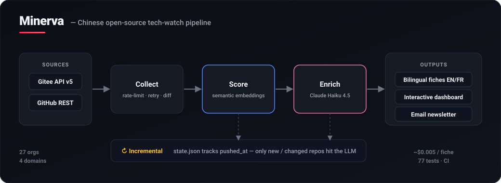

# Minerva

**Language:** 🇬🇧 English · [Français](README.fr.md)


**Minerva turns the Chinese open-source hardware ecosystem — most of it in
Chinese, fragmented across Gitee and GitHub — into decision-ready English/French
technical intelligence you can monitor over time.**

Automated technology-watch pipeline over the Chinese open-source ecosystem
(Gitee + GitHub), specialized in **embedded / IoT / robotics / edge-AI**: it
collects, scores relevance semantically, enriches with an LLM, and produces
structured bilingual **fiches** + an interactive dashboard + an email newsletter.



> **Status — working MVP.** The engine, a rigorously filtered corpus of
> **106 bilingual fiches** (recalibrated 2026-07-30 to cut generic big-tech noise
> — see [docs/SCORING.md](docs/SCORING.md)), the interactive dashboard, the
> newsletter and CI are functional today and reproducible from this repo. What's
> next (hosted freshness, data feed, an AtomGit/GitCode connector) is tracked
> honestly in the [roadmap](ROADMAP.md).

## Why it exists

The Chinese ecosystem ships enormous amounts of embedded, IoT, robotics and
edge-AI code — RTOSes, NPU/edge-AI SDKs, RISC-V toolchains, robotics stacks,
vendor BSPs. For a Western engineering or intelligence team it is effectively a
blind spot: it's in **Mandarin**, **fragmented** across Gitee *and* GitHub over
dozens of orgs (Gitee's own search is broken), and buried under forks and mirrors.
Missing it means missing a maturing RISC-V toolchain or an edge-AI runtime that
out-performs the one you ship — until it's already an industry fact.

Minerva removes that blind spot and hands you **decision-ready intelligence, not a
repo list** — including an explicit mapping to the **Western equivalent** of each
project. Full framing in **[docs/POSITIONING.md](docs/POSITIONING.md)**.

## Who it's for

| Audience | Job to be done |
|---|---|
| Embedded / IoT hardware companies | Evaluate Chinese RTOS/BSP/SDK maturity before designing them in; benchmark vs FreeRTOS/Zephyr. |
| SoC / semiconductor strategy & DevRel | Track competitor SDKs and the RISC-V / edge-AI toolchain landscape. |
| R&D / tech-scouting teams | Systematic scouting of Chinese alternatives in robotics, edge-AI, connectivity. |
| Competitive & market-intelligence analysts | Monitor a target's open-source footprint and its evolution, run over run. |
| Consultancies / analysts / investors | Due diligence on the OSS depth of Chinese hardware/AI players. |

**Use cases:** technology scouting · competitive intelligence · sourcing/BOM
decisions · standards tracking (OpenHarmony, RISC-V) · due diligence · edge-AI
benchmarking.

## What you get

- **Bilingual fiches** (EN default + FR) — one per repo, fixed parsable format:
  Type, Domain, Score, Problem solved, How it works, **Chinese specificity**,
  **Western equivalent**, Maturity, Language, source link. Both language sets are
  generated and kept in sync natively by every pipeline run (single source of
  facts + faithful translation — no drift).
- **Relevance + confidence scoring** — a 0–100 relevance score *and* a
  transparent data-quality confidence tier (High/Medium/Low) per project, so you
  can triage honestly. See [docs/SCORING.md](docs/SCORING.md).
- **Interactive dashboard** — single self-contained HTML file, filter by
  domain/type/score, full-text search, opens with no server.
- **Email newsletter** — rich HTML + plain-text, top findings + Edge-AI spotlight.
- **Incremental diff** — `state.json` tracks changes; each run reports NEW /
  MODIFIED / DELETED so it's a *monitoring* product, not a one-shot scrape.

## 🚀 30-second demo (no token required)

```bash
git clone <repo-url> minerva && cd minerva
pip install -r requirements.txt

# Open the pre-generated dashboard — no token needed
start output/dashboard.html      # Windows
xdg-open output/dashboard.html   # Linux
open output/dashboard.html       # macOS
```

The dashboard loads instantly (inlined JSON), filters by domain/type/score, and
searches full-text across the fiches.

**Example of a generated fiche** (`output/fiches/sophgo_tpu-mlir_fiche.md`):

```markdown
## sophgo/tpu-mlir
**Type:** Tool
**Domain:** Embedded / Edge AI
**Relevance score:** 70/100
**Problem solved:** Compile pre-trained neural network models (PyTorch, ONNX,
  TFLite, Caffe, HuggingFace) into optimized bmodel files for Sophgo TPUs...
**How it works:** MLIR compiler with multi-framework front-ends converting to a
  unified IR (Top/Tpu dialects), then lowering to bmodel via pattern rewrites...
**Chinese specificity:** Sophgo is a Chinese fabless vendor specialized in TPU
  SoCs; this compiler targets its architectures directly (bm1684x)...
**Western equivalent:** TVM (Apache), ONNX Runtime (Microsoft), TensorFlow Lite Converter
**Maturity:** Stable (★ 954, 226 forks, updated 2026-07)
**Language:** Bilingual CN-EN
**GitHub:** https://github.com/sophgo/tpu-mlir
```

## 🧠 How it works

A 3-stage incremental pipeline orchestrated by `src/pipeline.py`:

1. **Collect** (`fetcher.py` + `github_fetcher.py`) — official Gitee v5 and GitHub
   REST APIs, authenticated, rate-limited, with retry and mirror/fork/third-party
   filtering. The GitHub connector captures Chinese orgs absent from Gitee
   (Bouffalo, Sophgo, Unitree, Kendryte, Allwinner), producing the same repo schema.
2. **Score** (`analyzer.py`) — multilingual semantic embeddings vs the 4 domain
   definitions, plus maturity signals and a watched-account bonus.
3. **Enrich** (`translator.py`) — **Claude Haiku 4.5** turns the description +
   README into the structured fiche fields.

`state.json` remembers `pushed_at` per repo; the LLM is called only for missing or
modified fiches. See **[docs/ARCHITECTURE.md](docs/ARCHITECTURE.md)** for the full
design.

## 📊 Key figures

- **106 technical fiches** (bilingual EN/FR) across Gitee and GitHub — a
  deliberately *quality-over-quantity* corpus: admission v2 cut generic big-tech
  noise from **77% to 12%** of the corpus, putting hardware vendors and robotics
  at the center (Unitree 31, Sophgo 24, Espressif 13, Bouffalo 9, Kendryte,
  Sipeed, RT-Thread…).
- **27 organizations watched** (22 Gitee + 5 GitHub), 15 represented in the
  corpus · **4 domains** — Embedded 55, Edge AI 45, Robotics 9, IoT 2.
  *Coverage note: a 2026-07 full harvest showed 2,313/3,660 watched Gitee repos
  are stale >2 years (OpenHarmony migrated off Gitee) — the next coverage lever
  is an AtomGit/GitCode connector, tracked in the [roadmap](ROADMAP.md).*
- **LLM cost** ~$0.01 per repo (EN+FR pair, Haiku 4.5); full bootstrap ~$2-4; incremental runs
  cost only for changed repos
- **96 automated tests** + GitHub Actions CI; **$0** offline rescoring

## 📚 Documentation

| Doc | What's inside |
|---|---|
| [Positioning](docs/POSITIONING.md) | Value proposition, ICP, use cases, differentiation |
| [Business & monetization](docs/BUSINESS.md) | Revenue models, packaging/pricing, go-to-market |
| [Data sources & compliance](data-sources-and-compliance.md) | Per-source register: access method, API/scraping status, risks, decision |
| [Security](SECURITY.md) | Secret handling, pre-publication checklist, disclosure |
| [Sources posture](docs/SOURCES.md) | Narrative compliance posture & IP logic behind the register |
| [Scoring](docs/SCORING.md) | Relevance score + transparent confidence tier |
| [Architecture](docs/ARCHITECTURE.md) | Modules, data flow, design decisions, extension points |
| [Roadmap](ROADMAP.md) | MVP / V1 / V2 + honest TODOs and limitations |
| [Contributing](CONTRIBUTING.md) | Setup, adding orgs/domains, ground rules |
| [Changelog](CHANGELOG.md) | Version history |

## 🛠️ Full run & rebuild

```bash
# .env at the root must contain GITEE_TOKEN and ANTHROPIC_API_KEY (GITHUB_TOKEN optional)
python src/pipeline.py                 # incremental run (~10 min) — generates/updates BOTH the EN and FR fiche sets
python scripts/build_dashboard.py      # rebuild output/dashboard.html
python scripts/build_newsletter.py     # rebuild newsletter (HTML + TXT)
python scripts/rescore.py              # re-score offline after editing domains.json ($0)
```

## 📁 Project structure

```
minerva/
├── config/          # domains.json (4 domains), sources.json (watched orgs + seeds)
├── src/             # fetcher, github_fetcher, analyzer, embedder, translator,
│                    #   fiche_schema, pipeline
├── scripts/         # build_dashboard, build_newsletter, build_site, rescore,
│                    #   build_lang_fiches
├── output/          # fiches/ (EN), fiches_fr/ (FR), dashboard.html, newsletter_*,
│                    #   state.json, diff_*
├── docs/            # positioning, business, sources, architecture (+ assets)
├── tests/           # 96 pytest tests
└── .env             # GITEE_TOKEN, ANTHROPIC_API_KEY, GITHUB_TOKEN (gitignored)
```

## 🗺️ Domains covered

| Domain    | Concrete examples spotted                                                     |
|-----------|-------------------------------------------------------------------------------|
| Embedded  | RT-Thread, AliOS-Things, TencentOS-tiny, ESP-IDF, OpenHarmony device drivers  |
| IoT       | LuatOS, OpenHarmony OS, BL-MCU SDK, MQTT/LwIP stacks                           |
| Robotics  | RoboMaster RoboRTS, Unitree SDK, drones                                        |
| Edge AI   | ncnn (Tencent), PaddleOCR, MNN, K230 KPU SDK, nncase, Sophgo tpu-mlir          |

## ⚠️ Known limitations

- **Gitee `/search/repositories` is broken server-side** → discovery relies on a
  curated org list + `seeds` (documented workaround).
- **Tokens:** a Gitee token is needed for real runs; a `GITHUB_TOKEN` raises
  GitHub collection from 60 to 5000 req/h; an Anthropic key is needed to generate
  new fiches (offline rescoring works without it).
- LLM enrichment can be imperfect — every fiche links back to its source and uses
  a "to be confirmed" convention. See [ROADMAP.md](ROADMAP.md) for the full list.

## 🛠️ Requirements

```bash
pip install -r requirements.txt
```

`.env` at the root:

```
GITEE_TOKEN=xxxxxxxxxxxxxxxxxxxxx
ANTHROPIC_API_KEY=sk-ant-xxxxxxxxxx
GITHUB_TOKEN=ghp_xxxxxxxxxx        # optional — raises GitHub collection from 60 to 5000 req/h
```

## 📄 License

[Apache-2.0](LICENSE). Minerva stores repository metadata and its own original
summaries, links back to every source, and redistributes no third-party code —
see [docs/SOURCES.md](docs/SOURCES.md).
